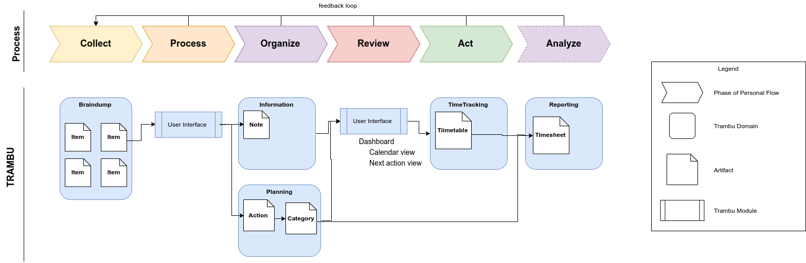
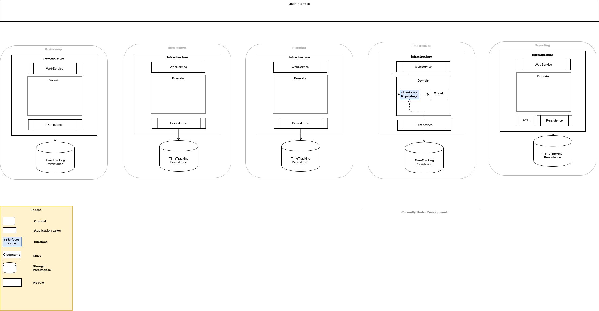

# TRAMBU Architecture

## Outline of trambu goal

TRAMBU is a tool to make task and time management easier for the user.
It will be an application that allows the user to store, and manage their entire personal and professional workload.

## Reference model

The extended "Getting things done" productivity model will be used as a reference for the flow of the application.

{width="50%"}

## Mapping process flow to TRAMBU components

{width="50%"}

# Philosophy

All development on this project is done following these principles:

> We value loose coupling and modularity over anything else.
> The architecture of the system will evolve, technical changes will be made, and libraries will be swapped out.
> By extension, we will design our system to as be adaptable as possible. 
> The application as a whole will be small, sharp tools that can be combined as needed.

> We value automating manual actions as much as possible, even if the short-term gain is minimal.

> Our definition of done for a task is: "All acceptance tests pass." 

> All essential documentation should be version controlled and preferably contained within the repository.

# Technical Views

## Component/Context View

{width="50%"}

The storages are in included in this view, to visualize that they exist withing a given bounded context.
This means that the stored data of a specific context should be protected from access from outside the context.
All interaction with this specific storage will happen through the interface provided to the outside world by the context.
In most cases, external components need not know of the specifics of data storage within a context.
This boundary is to be protected at all costs. **Shortcuts taken to share data between contexts by sharing a storage source are not acceptable.**

> __Storage__: a generic term to mean any kind of persistence capability. This can be plain text, a relational database, event storage, etc.
> It's function is to store application state for future reference.  

## Interaction View

## Deployment view

### As is:

* Self-contained deployables per context

# References

* Patterns, Principles, and Practices of Domain-Driven Design - Millet, Tune 2015 [\[link to book\]](https://www.oreilly.com/library/view/patterns-principles-and/9781118714706/).
* Getting things done - Allen, 2003 [\[link to book\]](https://www.amazon.com/Getting-Things-Done-Stress-Free-Productivity/dp/0143126563)
